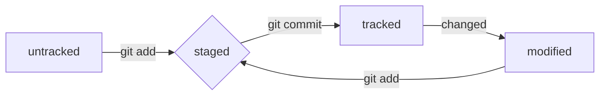

#Git Cheat Sheet

# Headers:
---
# H1
## H2
### H3
#### H4
##### H5
###### H6
---

# Highlighting
---
Cursive text *stars* or _underline_

Bolt text **double stars** or __double underline__

Combined **stars and _underline_**

Two tildes for ~~strike text~~
---

# Lists
---
1. First menu
2. Second menu


* Not numbered menu
* Second point
---

# Links
---
[Google](https://google.com "Google")
---


# Code
---
```bash
touch file.txt
echo "Hello!" > file.txt
cat file.txt
```

```c
int main(void) {
    printf("Hello, World!");
    return 0;
}
```
---

# HEAD
---
File **HEAD** - one of .git service files folders. It points to the commit that was made last (which is what the newest one is). Inside HEAD is a link to the service file: _refs/heads/main_. If you look at this file, you can see the hash of the last commit. _e007f5035f113f9abca78fe2149c593959da5eb7_
---

# Status
## untracked / tracked, staged and modified

- untracked: We said that new files in the Git repository are marked as untracked, that is, untracked. Git "sees" that such a file exists, but does not track changes to it. An untracked file has no previous versions committed in commits or via the git add command.
- staged: After executing the git add command, the file ends up in the staging area, that is, in the list of files that will be included in the commit. At this moment the file is in staged state.
- tracked: The tracked state is the opposite of untracked. It is quite broad in meaning: it includes files that have already been commited using git commit, as well as files that were added to the staging area with the git add command. That is, all files in which Git tracks changes in one way or another.
- changed: The modified state means that Git compared the contents of the file with the last saved version and found differences. For example, a file was committed and then changed.


---

# Git commands

## Initializing the repository
- `git init` (initializing the repository)

## Synchronization of local and remote repositories
- `git remote add origin` (link the local repository to the remote one with the URL)
- `git remote -v` (check that the reoisutiries are actually connected)
- `git push -u origin main` (for the first time, download all commits from the local repository to a remote one called origin)
- `git push` (upload commits to a remote repository after it has been linked using the -u flag)

## Preparing a file for commit
- `git add todo.txt` (prepare the todo.txt file for commit)
- `git add --all` (prepare for commit at once all the files in which there were changes, and all new files)
- `git add .` (preapre the current folder and all the files in it for commit)

## Creating and publishing a commit
- `git commit -m 'Commit comment'` (make a commit and leave a comment to make it easier to understand what changes have been made)
- `git push` (add changes to the remote repository)

## Viewing commit information
- `git log` (display a detailed history of commits)
- `git log --oneline` (show brief information about commits: a shortened hash and message)

## View file status
- `git status` (show the current state of the repository)

## Adding changes to the latest commit
- `git commit --amend --no-edit` (add changes to the last commit and leave the message the same)
- `git commit --amend -m 'New message'` (change the message for the last commit to New message)

## "Rollback" of files and commits
- `git restore --staged hello.txt` (transfer the hello.txt file from the staged state back to untracked or modified)
- `git restore hello.txt` (returh the hello.txt file to the latest version that was saved via git commit or git add)
- `git resed --hard b576d89` (delete all uncommitted changes from staging and the "working area" up to specified commit)

## View changes
- `git diff` (show changes in the "working area", that is, in modified files)
- `git diff a9928ab 11bada1` (print the difference between two commits)
- `git diff --staged` (show changes that have been added to staged files)

---
## Cloning someone else's repository
- `git clone URL` (recommend repositories with the URL from the account on my local computer)

## Creating branches
- `git branch NameBranch` (create a branch from the current one with the name)
- `git checkout -b NameBranch` (create a branch and immediately switch to it)

## Branch navigation
- `git branch` (show what branches there are in the repositories and which one I'm in. The current branch will be marked with `*`);
- `git branch -a` (open all grean branches, both local and remote)
- `git checkout NameBranch` (switched to the branch)

## Branch comparison
- `git diff main HEAD` (show the difference between the main branch and the pointer to HEAD)
- `git diff HEAD~2 HEAD` (show the difference between the commit that was two commits ago and the current one)

## Removing branches
- `git branch -d BranchName` (deleted the BranchName branch, but only if it was part of main)
- `git branch -D BranchName` (deleted the BranchName branch, even if it is not merged into main)

## Merging branches
- `git merge main` (merge the main branch with the current active branch)

## Working with a remote repository
- `git push -u origin BranchName` (push the new branch BranchName to the remote repository and link the local branch with the remote one, so that with additional commits you can simply write git push without -u)
- `git push BranchName` (push additional changes to the BranchName branch that already exists in the remote repository)
- `git pull` (pull changes to the current branch from a remote repository)
