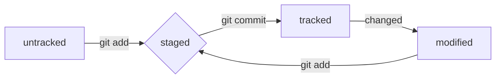

#Git Cheat Sheet

# Headers:
---
# H1
## H2
### H3
#### H4
##### H5
###### H6
---

# Highlighting
---
Cursive text *stars* or _underline_

Bolt text **double stars** or __double underline__

Combined **stars and _underline_**

Two tildes for ~~strike text~~
---

# Lists
---
1. First menu
2. Second menu


* Not numbered menu
* Second point
---

# Links
---
[Google](https://google.com "Google")
---


# Code
---
```bash
touch file.txt
echo "Hello!" > file.txt
cat file.txt
```

```c
int main(void) {
    printf("Hello, World!");
    return 0;
}
```
---

# HEAD
---
File **HEAD** - one of .git service files folders. It points to the commit that was made last (which is what the newest one is). Inside HEAD is a link to the service file: _refs/heads/main_. If you look at this file, you can see the hash of the last commit. _e007f5035f113f9abca78fe2149c593959da5eb7_
---

# Status
## untracked / tracked, staged and modified

- untracked: We said that new files in the Git repository are marked as untracked, that is, untracked. Git "sees" that such a file exists, but does not track changes to it. An untracked file has no previous versions committed in commits or via the git add command.
- staged: After executing the git add command, the file ends up in the staging area, that is, in the list of files that will be included in the commit. At this moment the file is in staged state.
- tracked: The tracked state is the opposite of untracked. It is quite broad in meaning: it includes files that have already been commited using git commit, as well as files that were added to the staging area with the git add command. That is, all files in which Git tracks changes in one way or another.
- changed: The modified state means that Git compared the contents of the file with the last saved version and found differences. For example, a file was committed and then changed.


---
